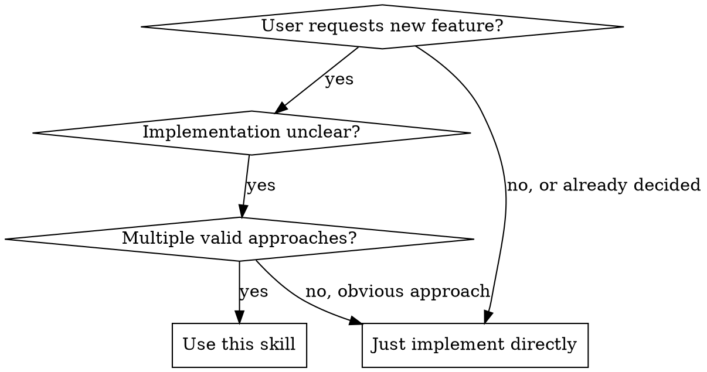
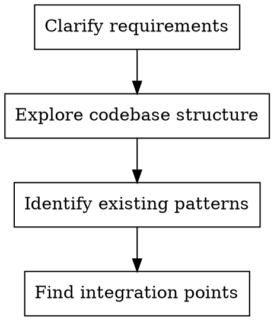
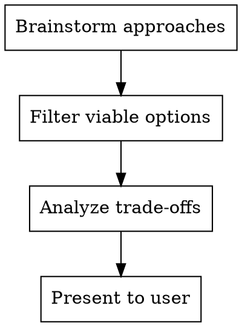
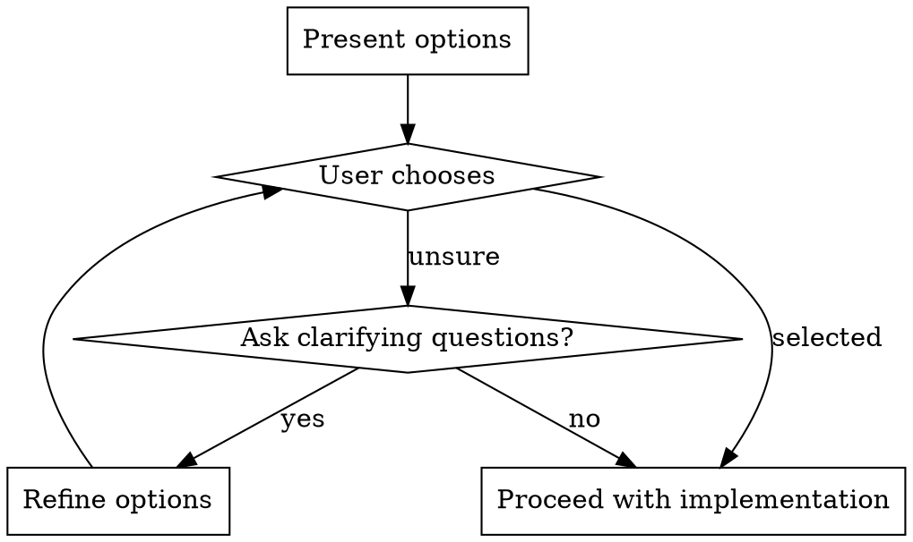

# Feature Design Advisor

## Overview

Analyze the existing codebase to propose multiple viable implementation approaches for new features, presenting options with trade-offs so the user can make informed architectural decisions.

**Core principle:** Don't just implement—explore first, then present options. The best approach depends on context the user provides.

## When to Use



**Use when:**
- User asks "how should I implement..." or "what's the best way to..."
- User describes a feature but not the implementation approach
- Multiple architectural choices exist (different patterns, libraries, or structures)
- Need to ensure new feature integrates well with existing code
- User is undecided between different approaches

**Don't use when:**
- Implementation is already specified and clear
- User has already decided on the approach
- Simple, obvious single-file changes
- Just fixing a bug with clear solution

## Core Pattern

### Phase 1: Understand and Explore



1. **Clarify user's intent**: Ask targeted questions if requirements are vague
   - What specific behavior do they want?
   - Are there constraints (performance, security, compatibility)?
   - What's the priority (speed, maintainability, simplicity)?

2. **Explore the codebase**: Use Task tool with Explore agent
   - Find relevant existing components
   - Identify architectural patterns in use
   - Locate similar features to reference

3. **Document existing patterns**: Note consistency requirements
   - Package structure
   - Naming conventions
   - Architecture style (MVVM, clean architecture, etc.)
   - Common libraries and utilities

### Phase 2: Design Options



For each option, specify:

| Aspect | What to Include |
|--------|-----------------|
| **Summary** | One-sentence description |
| **Files to create/modify** | Specific file paths |
| **How it works** | Brief explanation of the approach |
| **Pros** | Benefits (2-4 bullets) |
| **Cons** | Drawbacks (2-4 bullets) |
| **Complexity** | Simple/Medium/Complex |
| **Integration risk** | Low/Medium/High |

Present 2-4 options. Always include:
- One simple, straightforward approach
- One more robust/complete approach
- Any innovative or alternative approaches if applicable

### Phase 3: User Selection



Use AskUserQuestion tool when user is undecided:

```
Which approach would you prefer?
- Quick and simple: Get it working fast
- Robust and maintainable: More effort, better long-term
- [Other specific trade-offs]
```

## Quick Reference

| Situation | Action |
|-----------|--------|
| User asks "how to add X" | Explore codebase → propose options |
| User provides vague requirements | Ask clarifying questions first |
| Multiple architectural choices | Present 2-4 options with trade-offs |
| User unsure between options | Use AskUserQuestion to help decide |
| Simple obvious implementation | Skip this skill, implement directly |

## Implementation

### Example: Adding Password Export Feature

**User request:** "I want to add a feature to export passwords"

**Step 1: Explore codebase**
```
Task agent: Find how passwords are stored, retrieved, and displayed.
Result: Found PasswordItem model, PasswordListFragment, BackendService interface.
Existing pattern: Uses MVVM, Material Design 3, shared via ViewModel.
```

**Step 2: Design options**

| Option | Description | Complexity | Risk |
|--------|-------------|------------|------|
| **A. Simple JSON Export** | Export to Downloads folder as JSON | Low | Low |
| **B. CSV with Encryption** | Export encrypted CSV with password prompt | Medium | Medium |
| **C. Secure Share Link** | Generate encrypted upload link, no file storage | High | Medium |
| **D. Multiple Formats** | Settings menu with format choice | Medium | Low |

**Step 3: Present with trade-offs**

```
Option A - Simple JSON Export:
- Files: ExportUtil.java, menu item in PasswordListFragment
- Pros: Fast to implement, easy to debug, user control
- Cons: Unencrypted file, manual backup only
- Complexity: Simple

Option B - CSV with Encryption:
- Files: ExportUtil.java, EncryptionService, password dialog
- Pros: More secure, standard format, portable
- Cons: Requires password entry, more code
- Complexity: Medium

Option C - Secure Share Link:
- Files: New ExportActivity, backend API integration
- Pros: No files left on device, shareable, most secure
- Cons: Requires network, backend dependency
- Complexity: High

Option D - Multiple Formats:
- Files: ExportSettingsFragment, format adapters
- Pros: User choice, flexible, future-proof
- Cons: Most upfront work, more UI complexity
- Complexity: Medium
```

**Step 4: User chooses → Implement**

### Conversation Flow Example

```
User: "I want to add password export"

You: "I'll explore the codebase to find the best integration points..."

[After exploration]

You: """I found the password management structure. Here are your options:

1. Simple JSON Export (Recommended for MVP)
   - Add export button to PasswordListFragment
   - Export to Downloads as JSON
   - Fast to implement, user has full control

2. Encrypted Backup with Password
   - Requires password to open backup file
   - More secure but requires user to remember backup password

3. Cloud Sync Integration
   - Leverage existing backend
   - No files on device
   - Requires more backend work

Which approach interests you?
"""
```

## Common Mistakes

| Mistake | Fix |
|---------|-----|
| Jumping to implementation without exploring | Always explore codebase first with Task tool |
| Proposing only one option | Always present 2-4 alternatives |
| Ignoring existing patterns | Match the architecture that's already there |
| Options too similar | Ensure meaningful differences in trade-offs |
| Not checking dependencies | Verify if libraries/APIs already exist |
| Over-complicating simple requests | Match complexity to actual requirements |

## Codebase Integration Checklist

Before proposing options, verify:

- [ ] Package structure matches existing conventions
- [ ] Architecture style is consistent (MVVM, clean arch, etc.)
- [ ] Reuses existing components when possible
- [ ] Follows naming conventions
- [ ] Compatible with Android min SDK
- [ ] Uses existing utilities/services (BackendService, security, etc.)
- [ ] Respects security model (no plaintext passwords, etc.)

## Real-World Impact

**Before this skill:** Agents implement first approach they think of, often:
- Duplicating existing utilities
- Breaking architectural patterns
- Creating inconsistent code
- Missing simpler solutions

**After this skill:**
- Informed architectural decisions
- Consistent codebase patterns
- Reuse of existing components
- User gets choice based on their priorities
