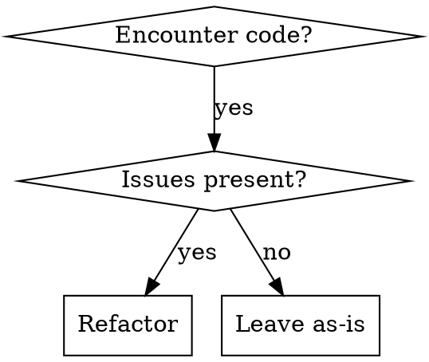

# Code Refactoring

## Overview
Refactoring improves code structure without changing external behavior. Always ensure tests pass before and after refactoring to prevent functional regressions.

## When to Use



**Use when you see:**
- Long methods (>50 lines)
- Duplicate code patterns
- Complex nested logic (3+ levels)
- Unused/dead code
- Poor naming that obscures intent
- God classes doing too much
- Magic numbers or strings
- Inconsistent code style

**Don't use for:**
- Adding new features
- Fixing bugs (use systematic-debugging)
- Performance optimization (different skill)
- Changing external APIs

## Before Refactoring Checklist

**Mandatory pre-refactoring steps:**

- [ ] **Understand existing behavior**: Read and understand all affected code
- [ ] **Identify test coverage**: Locate existing tests for the code
- [ ] **Create baseline tests**: If no tests exist, write tests capturing current behavior
- [ ] **Run tests successfully**: Ensure all tests pass before starting
- [ ] **Document the issue**: Note what specifically needs refactoring and why
- [ ] **Plan the changes**: Identify specific refactoring patterns to apply

**Safety verification:**
- [ ] Tests exist for critical paths
- [ ] Tests cover edge cases
- [ ] Current behavior is well understood

## Refactoring Patterns

| Pattern | When to Use | Transformation |
|---------|-------------|----------------|
| Extract Method | Long method with reusable logic | Move code block to named method |
| Extract Class | Class doing too many things | Split responsibilities into separate classes |
| Rename | Name doesn't reveal intent | Use descriptive, intention-revealing names |
| Remove Dead Code | Unused code exists | Delete completely (don't comment out) |
| Replace Magic Number | Raw numbers in code | Extract to named constant |
| Simplify Conditional | Complex nested logic | Use guard clauses, early returns |
| Extract Interface | Class has multiple roles | Define contract, implement separately |
| Introduce Parameter Object | Long parameter lists | Group related parameters |

## Quick Reference - Refactoring Workflow

1. **Run tests** → Must pass before starting
2. **Make one small change** → Single refactoring step
3. **Run tests** → Verify behavior unchanged
4. **Repeat** → Continue until done
5. **Final test run** → Full test suite passes

## After Refactoring Checklist

**Mandatory post-refactoring verification:**

- [ ] **All tests pass**: Original test suite still passes
- [ ] **No functional changes**: External behavior unchanged
- [ ] **Code is simpler**: Reduced complexity, better readability
- [ ] **Unused code removed**: No dead code remains
- [ ] **Tests still relevant**: Update tests if implementation changed (not behavior)
- [ ] **Build succeeds**: Project builds without errors
- [ ] **Manual verification**: Test affected functionality manually if critical

**Code quality verification:**
- [ ] Naming is clear and descriptive
- [ ] Methods are small and focused
- [ ] Logic is straightforward
- [ ] No unnecessary complexity

## Common Mistakes

| Mistake | Why Bad | Fix |
|---------|---------|-----|
| Refactoring without tests | Can't verify behavior unchanged | Always write tests first |
| Big bang refactoring | Too risky, hard to verify | Make small incremental changes |
| Changing behavior | Not refactoring, it's a feature change | Keep external behavior identical |
| Commenting out code | Clutters codebase, use git history | Delete unused code completely |
| Refactoring and features together | Confuses changes, harder to verify | Separate refactoring from new features |
| Skipping tests "just this once" | Slippery slope to broken code | Never skip, always verify |
| Renaming without global search | Breaks references in other files | Use project-wide rename |

## Red Flags - STOP and Reconsider

- Thinking "I'll fix tests later"
- Making multiple changes at once
- Changing external APIs or behavior
- Commenting out code instead of deleting
- Feeling uncertain about what code does
- No tests exist and not writing them
- "This is simple, I don't need to run tests"

**All of these mean: Stop. Reassess approach.**

## Example: Extract Method

**Before:**
```java
public void processPassword(PasswordItem item) {
    // Validate
    if (item == null) {
        throw new IllegalArgumentException("Item cannot be null");
    }
    if (item.getTitle() == null || item.getTitle().isEmpty()) {
        throw new IllegalArgumentException("Title required");
    }

    // Process
    String encrypted = backendService.encrypt(item.getPassword());
    item.setPassword(encrypted);
    backendService.save(item);
}
```

**After:**
```java
public void processPassword(PasswordItem item) {
    validatePasswordItem(item);
    saveEncryptedPassword(item);
}

private void validatePasswordItem(PasswordItem item) {
    if (item == null) {
        throw new IllegalArgumentException("Item cannot be null");
    }
    if (item.getTitle() == null || item.getTitle().isEmpty()) {
        throw new IllegalArgumentException("Title required");
    }
}

private void saveEncryptedPassword(PasswordItem item) {
    String encrypted = backendService.encrypt(item.getPassword());
    item.setPassword(encrypted);
    backendService.save(item);
}
```

## Real-World Impact

**Before refactoring:** 200-line method with nested conditionals, impossible to test, changes frequently broke unrelated features

**After refactoring:** Split into 8 focused methods, each testable, changes isolated to specific methods, 70% reduction in bugs

## Key Principles

1. **Two hats**: Either refactoring OR adding features, never both simultaneously
2. **Small steps**: Make the smallest change that compiles, then test
3. **Frequent testing**: Run tests after every single change
4. **Preserve behavior**: External behavior must remain identical
5. **Code ownership**: You're responsible for ensuring tests pass
