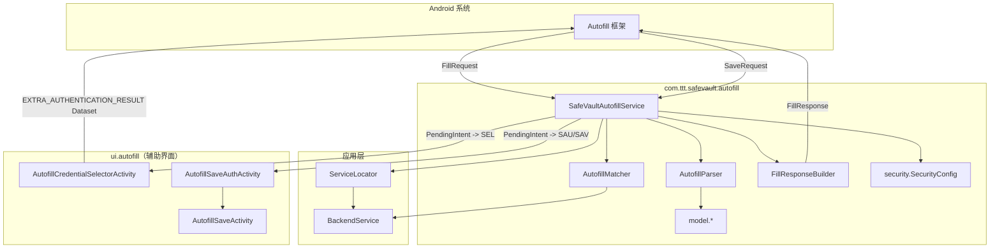

# SafeVault 自动填充实现说明

本文档描述 `android/app/src/main/java/com/ttt/safevault/autofill/` 包下的**完整自动填充实现**：从系统 `AutofillService` 回调、AssistStructure 解析、凭据匹配、`FillResponse`/`Dataset` 构建，到与 `BackendService`、UI Activity 的衔接。为便于端到端理解，文末简要列出 **Manifest / XML / 设置页 / `ui.autofill`** 等外部依赖；核心算法与数据流均以 `autofill` 包为准。

---

## 1. 架构总览

**设计要点：**

- **解析**（`AutofillParser`）：把 `FillRequest` / `SaveRequest` 里的 `AssistStructure` 转成 `AutofillParsedData` + `AutofillField` 列表；Save 场景下还会把用户输入的**实际值**写回字段模型。
- **业务与安全**（`SafeVaultAutofillService`）：忽略本应用、应用阻止列表、后台超时锁定；未解锁时通过认证 `IntentSender` 拉起选择器；已解锁时在服务线程内匹配凭据并构建响应。
- **匹配**（`AutofillMatcher`）：按 Web 域名或 Android 包名，从 `BackendService.getAllItems()` 里筛 `PasswordItem`。
- **响应**（`FillResponseBuilder`）：生成多个 `Dataset`（每条凭据一条）、底部「打开密码库」认证数据集、以及 `SaveInfo` 以支持保存新密码。

---

## 2. 包内文件与职责

| 路径 | 职责 |
|------|------|
| `SafeVaultAutofillService.java` | 继承 `android.service.autofill.AutofillService`，实现 `onFillRequest` / `onSaveRequest`，编排解析、匹配、构建响应与启动 Activity。 |
| `parser/AutofillParser.java` | 解析 `AssistStructure`，识别用户名/密码等字段类型，提取 Web 域名、包名、标题；Save 时提取字段真实值。 |
| `matcher/AutofillMatcher.java` | 根据 `AutofillRequest` 的域名或包名匹配 `PasswordItem` 列表。 |
| `builder/FillResponseBuilder.java` | 构建 `FillResponse`：`Dataset`（直接填充或需认证）、`SaveInfo`。 |
| `model/AutofillField.java` | 单字段模型：`AutofillId`、hint、可选 value、inputType、是否聚焦、`FieldType`。 |
| `model/AutofillParsedData.java` | 一次解析结果：字段列表 + 域名/包名/应用名/标题/isWeb。 |
| `model/AutofillRequest.java` | 提交给匹配器与 Builder 的请求：用户名/密码字段的 `AutofillId` 列表 + 元数据。 |
| `security/SecurityConfig.java` | 自动填充专用阻止包名列表；日志脱敏工具方法。 |

---

## 3. 系统注册与元数据（非 autofill 包内，但必需）

### 3.1 `AndroidManifest.xml`

- 声明 `service`：`android:name=".autofill.SafeVaultAutofillService"`，`android:permission="android.permission.BIND_AUTOFILL_SERVICE"`，`exported="true"`。
- `intent-filter`：`action android.service.autofill.AutofillService`。
- `meta-data`：`android:name="android.autofill"`，`android:resource="@xml/autofill_service_configuration"`。

### 3.2 `res/xml/autofill_service_configuration.xml`

根节点为 `<autofill-service>`，其中 `android:settingsActivity` 指向用户在系统「自动填充服务」设置里点击齿轮时打开的 Activity（当前为 `com.ttt.safevault.ui.MainActivity`）。

### 3.3 用户在应用内打开系统自动填充设置

实现位于 `SettingsFragment`（非本包）：使用 `Settings.ACTION_REQUEST_SET_AUTOFILL_SERVICE`，`data` 为 `package:<本应用包名>`，失败时回退 `Settings.ACTION_SETTINGS`。启用后系统才会向 `SafeVaultAutofillService` 派发请求。

---

## 4. 数据模型

### 4.1 `AutofillField`

- **作用**：表示 AssistStructure 中一个可参与自动填充的视图节点。
- **核心字段**：
  - `AutofillId autofillId`：系统填充目标标识（必填才有意义）。
  - `String hint`：来自 `autofillHints` / `View` hint / text 等。
  - `String value`：主要在 **Save** 流程由 `AutofillParser` 写入用户实际输入。
  - `int inputType`、`boolean isFocused`、`FieldType fieldType`。
- **`FieldType`**：`USERNAME`、`PASSWORD`、`EMAIL`、`PHONE`、`ID_CARD`、`UNKNOWN`。

### 4.2 `AutofillParsedData`

- **内容**：`List<AutofillField> fields`，以及 `domain`、`packageName`、`applicationName`、`title`、`isWeb`。
- **便捷方法**：
  - `getUsernameFields()`：`USERNAME`、`EMAIL`、`PHONE`、`ID_CARD` 均视为「用户名侧」候选，用于收集要填充的用户标识类 `AutofillId`。
  - `getPasswordFields()`：仅 `PASSWORD`。

### 4.3 `AutofillRequest`

- **内容**：
  - `List<AutofillId> usernameIds`、`List<AutofillId> passwordIds`。
  - 元数据：`domain`、`packageName`、`applicationName`、`isWeb`。
- **构建**：由 `SafeVaultAutofillService.buildAutofillRequest()` 从 `AutofillParsedData` 汇总；若用户名与密码 `AutofillId` 均为空则视为无法识别，回调 `onFailure`。

---

## 5. `AutofillParser`：AssistStructure 解析详解

### 5.1 入口

| 方法 | 输入 | 输出 |
|------|------|------|
| `parseFillRequest(FillRequest)` | 系统填充请求 | `AutofillParsedData`，不含用户输入明文（仅结构） |
| `parseSaveRequest(SaveRequest)` | 系统保存请求 | 先 `parseAssistStructure`，再 `extractFieldValues` 把各字段 **AutofillValue** 合并进 `AutofillField` |

两处均取 `request.getFillContexts()` 中**最后一个** `FillContext` 的 `AssistStructure`（最新结构快照）。

### 5.2 遍历与元数据

- `parseAssistStructure`：对每个 `WindowNode` 的根 `ViewNode` 递归 `parseViewNode`。
- `extractMetadata`：
  - Web：`node.getWebDomain()` 非空则 `setDomain`、`setIsWeb(true)`。
  - 原生：`node.getIdPackage()` 设置 `packageName`。
  - 标题：`extractTitle` 在 API 26+ 下通过 `HtmlInfo`，若 tag 为 `title` 且节点有 text，则 `setTitle`。

### 5.3 可填充节点判定 `isAutofillable`

需同时满足：

- `getAutofillId() != null`。
- `getAutofillType()` 为 `AUTOFILL_TYPE_TEXT` 或 `AUTOFILL_TYPE_NONE`（兼容部分 Web 字段）。
- **Web 字段**（`webDomain` 非空）：直接认为可填充（条件更宽松）。
- **非 Web**：需 `autofillHints` 非空 **或** `inputType != 0`。

### 5.4 字段类型识别 `identifyFieldType`

优先级概览：

1. **排除列表** `isExcludedField`：hint / id / HTML 属性中含验证码、搜索、OTP、短信码等关键词则返回 `UNKNOWN`（不参与填充/保存逻辑中的用户名密码管道）。
2. **`autofillHints`**：按密码 → 手机 → 身份证 → 邮箱 → 用户名顺序匹配（子串匹配，小写）。
3. **`inputType`**：密码变体、邮箱变体、`TYPE_CLASS_PHONE` 等。
4. **节点 `hint` 文本**：同上关键词表。
5. **`idEntry`**：同上关键词表。
6. **Web `HtmlInfo`（API 26+）**：解析 `type`、`name`、`id`、`autocomplete`、`placeholder` 等属性做匹配；**不再**默认把所有 `input type=text` 当作用户名。

### 5.5 关键词表（摘要）

- **用户名类**：`View.AUTOFILL_HINT_USERNAME`、`EMAIL_ADDRESS` 及常见英文变体。
- **密码类**：`View.AUTOFILL_HINT_PASSWORD` 及 `password`、`pwd` 等。
- **邮箱 / 手机 / 身份证**：各自列表含中英文关键词。
- **排除**：`captcha`、`verify`、`search`、`otp`、`code`、`pin` 等（含中文）。

### 5.6 Save 专用：字段值提取

- `extractFieldValues` 递归 `ViewNode`：若 `getAutofillId()` 与 `getAutofillValue()` 均非空，则 `extractValueFromAutofillValue`（优先 `isText()` 的 text，否则 `node.getText()`），再通过 `updateFieldValue` 替换 `AutofillParsedData` 中对应 `AutofillField` 为带 `value` 的新实例。密码仅在日志中记录长度，不打印明文。

---

## 6. `AutofillMatcher`：凭据匹配逻辑

### 6.1 前置条件

- `BackendService` 非空且 `isUnlocked()` 为 true，否则返回空列表。
- `getAllItems()` 为空则返回空列表。

### 6.2 主流程 `matchCredentials`

1. 若 `isWeb == true` 且 `domain != null`：先 `matchByDomain`。
2. 否则若 `packageName != null`：`matchByPackageName`。
3. 若结果为空：**备用路径**——有域名则再按域名匹配；仍空且有包名再按包名匹配。

### 6.3 域名匹配 `matchByDomain`

- 对每个 `PasswordItem`，从 `item.getUrl()` 用 `URI` 或回退字符串规则提取 host，再 `normalizeDomain`（小写、去 `www.`）。
- **精确匹配**：规范化后相等。
- **子域名匹配** `isSubdomainMatch`：比较双方 `extractRootDomain`（取主机名最后两段作为「根域名」近似），相等则匹配。

### 6.4 包名匹配 `matchByPackageName`

- 遍历条目 URL，若 URL **字符串包含**目标 `packageName` 则命中（兼容 `android://包名` 等存法）。

### 6.5 日志

- `Log.d` + 可选写入 `Android/data/com.ttt.safevault/files/autofill_logs/autofill_matcher.log`。

---

## 7. `FillResponseBuilder`：FillResponse / Dataset / SaveInfo

### 7.1 `buildResponse(AutofillRequest, List<PasswordItem>, IntentSender authIntentSender, boolean isLocked)`

**分支 A：`authIntentSender != null && isLocked`（应用锁定）**

- **不添加**任何「直接填充」凭据 `Dataset`。
- 仅添加一个 **认证用** `createVaultDataset`：展示「密码库已锁定」类文案，`setAuthentication(authIntentSender)`，用户点击后由系统启动认证流程（实际进入 `AutofillCredentialSelectorActivity` 等）。
- 仍设置 `SaveInfo`（若可构建），以便用户解锁后保存流程仍可用。

**分支 B：未锁定**

- 对每个匹配到的 `PasswordItem`：`createDataset` —— 向所有 `usernameIds` 填 `AutofillValue.forText(username)`，向所有 `passwordIds` 填密码；展示用 `RemoteViews` 布局 `autofill_dataset_item`，用户名展示为掩码。
- 最后追加一个 **「打开密码库」** `createVaultDataset`：`setValue(..., null)` 占位以绑定字段，并 `setAuthentication(authIntentSender)`（未锁定时用于打开选择器界面而非直接填值）。
- `SaveInfo`：`SAVE_DATA_TYPE_PASSWORD`，必填 id 为所有密码字段；用户名字段作为 `setOptionalIds`。

### 7.2 `createSaveInfo`

- 若无密码字段则返回 null（不附加保存能力）。
- 否则 `SaveInfo.Builder(SAVE_DATA_TYPE_PASSWORD, passwordIds)` + 可选 `usernameIds`。

### 7.3 日志

- 与 Matcher 类似，额外写入 `autofill_builder.log`。

---

## 8. `security.SecurityConfig`（autofill 包）

- **`BLOCKED_PACKAGES`**：其它密码管理器、系统设置/SystemUI、开发工具等；`isBlocked(packageName)` 在 `onFillRequest` / `onSaveRequest` 开头用于直接拒绝服务（填充返回 null success / 保存 onFailure）。
- **`maskUsername` / `maskPassword` / `maskDomain`**：静态脱敏工具，供日志或展示使用（注意：与 `com.ttt.safevault.security.SecurityConfig` 为不同类，勿混淆）。

---

## 9. `SafeVaultAutofillService`：服务生命周期与请求处理

### 9.1 成员与初始化

- `ExecutorService executor`：单线程池，**在后台线程**执行 `onFillRequest` 主体，避免阻塞系统 Binder 线程。
- `onCreate`：`ServiceLocator.getInstance().getBackendService()`，`new SecurityConfig()`。

### 9.2 `onFillRequest` 流程（摘要）

1. `AutofillParser.parseFillRequest` → `AutofillParsedData`；失败则 `callback.onFailure`。
2. **忽略本应用**：`parsedData.getPackageName()` 与 `getPackageName()` 相同则 `onSuccess(null)`。
3. **阻止列表**：`securityConfig.isBlocked(packageName)` 则 `onSuccess(null)`。
4. `buildAutofillRequest`；失败则 `onFailure`。
5. **`checkBackgroundTimeoutAndLock()`**：通过 `BackendService.getBackgroundTime()` 与 `SessionGuard.shouldLockBySessionTimeout` 判断，超时则 `backendService.lock()`。说明：自动填充触发时主界面可能不在前台，必须在服务内主动会话超时处理。
6. **解锁状态**：`backendService.isUnlocked()`；构造 `Intent` → `AutofillCredentialSelectorActivity`，携带 `domain`、`packageName`、`title`、`isWeb`、`username_ids`、`password_ids` 的 `ArrayList`；若锁定则 `needs_auth=true`。
7. `PendingIntent.getActivity(..., FLAG_IMMUTABLE | FLAG_UPDATE_CURRENT)` → `IntentSender`。
8. 若未锁定：`new AutofillMatcher(backendService).matchCredentials(autofillRequest)`。
9. `FillResponseBuilder.buildResponse(...)` → `callback.onSuccess(response)` 或 `onSuccess(null)`；异常则 `onFailure`。

**认证结果路径**：用户在选择器里选定条目后，`AutofillCredentialSelectorActivity` 通过 `Intent` 放入 `AutofillManager.EXTRA_AUTHENTICATION_RESULT`（`Dataset`），系统将其用于完成填充（无需用户再次点击数据集）。

### 9.3 `onSaveRequest` 流程（摘要）

1. `AutofillParser.parseSaveRequest`；失败则 `onFailure`。
2. 忽略本应用：与填充相同逻辑，此处对 Save 使用 `onFailure("忽略自己的应用")`。
3. 从解析结果中按类型提取用户名（用户名 → 邮箱 → 手机）与密码；密码为空则失败。
4. 原生应用时尝试 `getApplicationName(packageName)` 作为展示名；`title` 缺省则用域名/应用名/包名兜底。
5. `Intent` 指向 **`AutofillSaveAuthActivity`**，携带 username/password/domain/packageName/title/isWeb，`FLAG_ACTIVITY_NEW_TASK`。
6. `PendingIntent.getActivity` → `callback.onSuccess(intentSender)`，由系统拉起保存前认证界面；认证通过后再进入 `AutofillSaveActivity` 做去重与写入（见下节）。

### 9.4 调试日志

- `logDebug` 除 `Log.d` 外，追加写入 `Android/data/com.ttt.safevault/files/autofill_logs/autofill_service.log`（硬编码包数据目录前缀，与 Matcher/Builder 一致）。

### 9.5 `onDestroy`

- 清空 `backendService` / `securityConfig` 引用，`executor.shutdownNow()`。

---

## 10. 与 `ui.autofill` 的衔接（完整用户路径）

以下类不在 `autofill` 目录内，但与 `SafeVaultAutofillService` 直接配合，构成**完整**自动填充产品行为：

| Activity | 作用 |
|----------|------|
| `AutofillCredentialSelectorActivity` | 作为认证/选择 UI：`Dataset.setAuthentication` 启动后，生物识别或主密码解锁，展示匹配列表；选中后 `setResult` + `EXTRA_AUTHENTICATION_RESULT` 返回 `Dataset`。 |
| `AutofillSaveAuthActivity` | Save 流程前强制清会话并启动 `LoginActivity`，成功后再启动 `AutofillSaveActivity`。 |
| `AutofillSaveActivity` | 展示预填用户名/密码、站点或 `android://包名`，去重检测后调用 `BackendService` 写入；`FLAG_SECURE` 等与应用安全策略一致。 |

布局资源包括 `autofill_auth_item.xml`、`autofill_dataset_item.xml` 等，与 `FillResponseBuilder` / 选择器 UI 对应。

---

## 11. 依赖与约束小结

- **最低 API**：项目 minSdk 29；自动填充框架本身为 API 26+，当前代码广泛使用 API 26+ 类型（如 `HtmlInfo`），与 minSdk 一致。
- **数据与加密**：vault 读写一律通过 `BackendService`；`autofill` 包不实现加解密，仅消费已解密 `PasswordItem` 或提交保存意图到 UI。
- **线程**：填充请求在 `executor` 中执行；回到系统回调仍在该线程，需注意 `FillCallback` 的线程约定（按 AOSP 实现应在同一线程调用回调；若后续改为 UI 线程，需核对文档）。
- **可观测性**：三处文件日志路径均依赖应用外部存储私有目录，仅用于调试；生产环境可考虑降级或开关。

---

## 12. 扩展与维护建议

- **匹配算法**：`extractRootDomain` 对多级后缀（如 `.co.uk`）为简化实现；若需更精准可引入公共后缀列表或 URI 规范化库。
- **阻止列表**：按产品策略维护 `SecurityConfig.BLOCKED_PACKAGES`，注意厂商定制包名。
- **解析**：新增 App/Web 形态时，优先在 `AutofillParser.identifyFieldType` 增加规则与测试页面。
- **Builder**：若需「仅认证、不展示多条 Dataset」的 ROM 兼容策略，可在 `buildResponse` 分支中收敛 Dataset 顺序或合并展示。

---

*文档版本：与仓库 `autofill` 包源码同步整理；路径以 `android/app/src/main/java/com/ttt/safevault/autofill/` 为准。*
